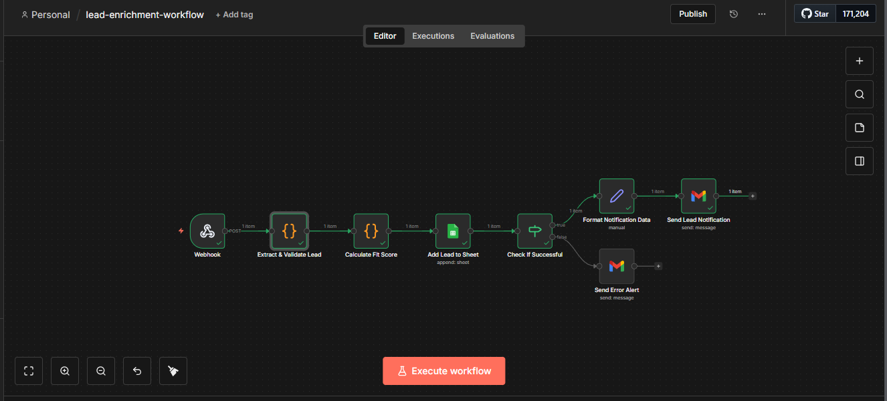

# Lead Enrichment Pipeline

> Automated lead processing system using n8n to verify emails, enrich company data, score leads, and route to the right sales rep - without manual research

[](LICENSE)
[](https://n8n.io)



---

## Table of Contents

- [Overview](#overview)
- [Features](#features)
- [Demo](#demo)
- [Prerequisites](#prerequisites)
- [Installation](#installation)
- [Usage](#usage)
- [Expected Output](#expected-output)
- [Sample Data](#sample-data)
- [Troubleshooting](#troubleshooting)
- [License](#license)
- [Acknowledgments](#acknowledgments)

---

## Overview

**Problem:** Sales teams waste 4–6 hours weekly researching leads manually, copy-pasting emails into verification tools, looking up company info on LinkedIn, manually scoring leads for prioritization, and routing them to reps with no standardized process. That's 20+ hours per month per rep and over $6,000 annually in lost selling time.

**Solution:** This n8n workflow automatically enriches every incoming lead the moment they enter the pipeline. It verifies the email, pulls company intelligence, calculates a fit score, assigns the right rep, creates a CRM record, and sends an instant notification, all at zero monthly cost using free-tier tools.

**Technology:**
- n8n (workflow orchestration - self-hosted or cloud)
- Hunter.io (email verification - free tier: 25/month)
- Clearbit OR BuiltWith (company enrichment - free tiers)
- Google Sheets / Airtable / Notion (CRM storage - all free tiers)
- Slack / Gmail (rep notifications)

> **Note:** This workflow is designed to run at $0/month using Google Workspace free tier and optional free API tiers.

---

## Features

- Webhook-based lead capture from any form (Typeform, Google Forms, website)
- Email verification with deliverability scoring and corporate domain detection
- Company intelligence enrichment (industry, size, revenue, tech stack)
- Automated fit scoring from 0–100 based on configurable criteria
- Territory and company-size-based rep assignment
- Auto-created CRM records in Google Sheets, Airtable, or Notion
- Instant Slack DM or Gmail alert to the assigned rep with full lead card
- Error logging and manual review flagging for failed enrichments

---

## Demo

### Audio Case Study (Coming Soon)

### Visual Demo


---

## Prerequisites

**Required:**
- **n8n instance** (self-hosted via Docker OR n8n cloud)
  - Self-hosted install: https://docs.n8n.io/hosting/installation/docker/
  - Cloud trial: https://n8n.io/cloud
- **Google account** for Sheets and Gmail integration

**Optional (all free tiers available):**
- Hunter.io account - email verification (25/month free)
- Clearbit OR BuiltWith account - company enrichment
- Airtable account - alternative CRM storage
- Slack workspace - rep notifications

---

## Installation

### Quick Start: Import Workflow (5 minutes)

1. **Copy the Google Sheet CRM template:**
   - Open: [Lead Enrichment Database Template](https://docs.google.com/spreadsheets/d/1GZq6VN9YdE3qZohacxJiHZAie8o42CwRE6_7yT5DAEU/edit?usp=sharing)
   - Click **File → Make a copy**
   - Rename it: `My Leads Database`

2. **Download workflow export:**
   - Go to: [Releases](https://github.com/Dessybabybaby/lead-enrichment-pipeline/releases)
   - Download `lead-enrichment-workflow.json`

3. **Import to n8n:**
   - Open n8n UI
   - Click **"Workflows"** → **"Add Workflow"** → **"Import from File"**
   - Select downloaded `lead-enrichment-workflow.json`
   - Click **"Import"**

4. **Configure Google credentials:**
   - Click the **"Gmail"** node → **"Select Credential"** → authorize your Google account
   - Click the **"Google Sheets"** node → same OAuth2 flow
   - Update the Sheet ID in the **"Add Lead to Sheet"** node with your copied template's ID

5. **Configure optional API credentials:**
   - **Hunter.io:** Retrieve API key from your Hunter.io dashboard → paste in the **"Verify Email"** node
   - **Clearbit / BuiltWith:** Retrieve API key → paste in the **"Enrich Company"** node
   - **Airtable:** Create a personal access token → add in n8n Credentials
   - **Slack:** Authorize via OAuth2 → confirm bot is added to your target channel

6. **Configure the webhook:**
   - Copy the webhook URL from the **"Webhook Trigger"** node
   - Paste it into your form tool (Typeform, Google Forms, or website contact form)

7. **Activate workflow:**
   - Toggle **Active** (top-right of n8n UI)

8. **Test manually:**
```bash
   curl -X POST https://YOUR-N8N-URL/webhook/lead-enrichment \
     -H "Content-Type: application/json" \
     -d '{
       "email": "test@techcorp.io",
       "company": "TechCorp",
       "role": "VP Sales",
       "source": "webinar"
     }'
```
   Verify the enriched record appears in your Google Sheet or Airtable base.

---

## Usage

### Automatic Execution
Workflow triggers instantly on every webhook submission from your connected form or website.

### Manual Execution
1. Open the workflow in n8n
2. Click **Execute Workflow**
3. Observe each node's execution in real time
4. Check Google Sheets / Airtable for the enriched lead record and Slack / Gmail for the rep notification

### Workflow Logic

1. Webhook receives lead submission (email, company, role, source)
2. Parse and extract all lead fields
3. Verify email - check format, deliverability, and corporate domain
4. Enrich company - detect industry, size, revenue, and tech stack
5. Calculate fit score (0–100) based on role, industry, size, and source
6. Assign rep based on territory and company size rules
7. Create enriched CRM record in Google Sheets / Airtable / Notion
8. Send Slack DM or Gmail alert to assigned rep with full lead card
9. On failure: log error, flag for manual review, send alert

### How Enrichment Works (No API Required)

**Email Validation**
- Regex pattern matching for correct format
- Corporate domain detection (excludes gmail, yahoo, hotmail)

**Industry Detection**
Keyword matching from company name:
- "Tech", "Software", "Cloud" → Technology
- "Bank", "Finance", "Capital" → Finance
- "Health", "Medical", "Pharma" → Healthcare

**Company Size Estimation**
- Known large companies (Microsoft, Google, etc.) → 1000+
- Free email domains (gmail.com) → 1–10 (startup/freelancer)
- Custom domain → 51–200 (default mid-size)

**Scoring Algorithm**
```
Total Score (0–100):
- Email valid + corporate domain:     25 points
- Company size (ideal 201–1000):      25 points
- Role (C-level / VP / Director):     30 points
- Industry (Technology / Finance):    20 points
- Source quality (Referral/Webinar):  10 points
```

---

## Expected Output

**Enriched Lead Record (Webhook Version)**
```json
{
  "email": "john.doe@techcorp.io",
  "emailValid": true,
  "linkedinUrl": "https://linkedin.com/in/johndoe",
  "company": "TechCorp",
  "industry": "Software",
  "companySize": "50-200",
  "revenue": "$10M-$50M",
  "techStack": ["AWS", "React", "Node.js"],
  "role": "VP Engineering",
  "fitScore": 85,
  "assignedRep": "Sarah (Enterprise)",
  "source": "webinar signup",
  "enrichedAt": "2026-01-18T10:30:00Z"
}
```

**Enriched Lead Record (Google Sheet Version)**
```json
{
  "timestamp": "2026-01-18T14:30:00Z",
  "name": "Sarah Johnson",
  "email": "sarah.johnson@microsoft.com",
  "company": "Microsoft Corporation",
  "role": "Chief Technology Officer",
  "source": "referral",
  "emailValid": true,
  "industry": "Technology",
  "companySize": "1000+",
  "fitScore": 95,
  "grade": "A - Hot Lead",
  "scoreBreakdown": "Valid email: +15 | Corporate domain: +10 | Ideal size: +18 | C-level: +30 | Target industry: +20 | Referral: +10",
  "assignedRep": "Sarah (Enterprise)",
  "status": "New"
}
```

**Slack / Email Notification**
```
[NEW LEAD — Score: 95 | Grade: A - Hot Lead]

Name:     Sarah Johnson
Email:    sarah.johnson@microsoft.com
Company:  Microsoft Corporation (1000+ employees)
Role:     Chief Technology Officer
Industry: Technology
Source:   Referral

Assigned To: Sarah (Enterprise)
Action: Follow up within 1 hour
```

---

## Sample Data

Test the workflow with sample payloads before going to production.

**Webhook Input:**
```json
{
  "email": "john.doe@techcorp.io",
  "company": "TechCorp",
  "role": "VP Engineering",
  "source": "webinar signup"
}
```

**Google Sheet Input:**
```json
{
  "email": "sarah.johnson@microsoft.com",
  "company": "Microsoft Corporation",
  "role": "Chief Technology Officer",
  "source": "referral"
}
```

---

## Troubleshooting

| Issue | Solution |
|-------|----------|
| Email verification fails | Check Hunter.io API key; verify monthly quota is not exceeded |
| Company data returns empty | Try BuiltWith if Clearbit fails; check company name spelling |
| Airtable record not created | Verify base ID; confirm field names match exactly (case-sensitive) |
| No Slack notification | Confirm bot is added to channel; verify OAuth scope includes `chat:write` |
| No data in Sheet | Check Sheet ID; re-authorize Google Sheets OAuth2 credentials |
| No email received | Check Gmail OAuth; verify recipient address is correct |
| Score always low | Review scoring logic in Function node; check test data quality |
| Webhook not triggering | Confirm workflow is set to Active; verify webhook URL in your form |

---

## License

This project is licensed under the MIT License - see [LICENSE](LICENSE) file for details.

You are free to:
- ✓ Use commercially
- ✓ Modify
- ✓ Distribute
- ✓ Private use

---

## Acknowledgments

- Built with [n8n.io](https://n8n.io) — workflow automation platform
- Zero-cost alternative to expensive enrichment tools like Apollo.io and ZoomInfo
- Part of a 30-day automation portfolio sprint

---

## Contact & Portfolio

**Creator:** Achusi Desmond
- Portfolio: [My Story](https://achusi-desmond.vercel.app/)
- GitHub: [Dessybabybaby](https://github.com/Dessybabybaby)
- LinkedIn: [Achusi Desmond](https://linkedin.com/in/achusi-desmond)

---

**If this pipeline accelerates your sales process, please star the repo!**
